# DShop

## Overview

This DShop(decentralized shop) empower users to create their own shops with a highly secure cryptocurrency payment system. It supports major blockchains like Bitcoin, Ethereum, and ICP for accepting value, ensuring a seamless and versatile shopping experience.

## Features

### Shop Creation

- Provides a platform for users to easily create their own decentralized shops.
- Enables customization of shop details and product listings.

### Secure Cryptocurrency Payment System

- Implements a robust cryptocurrency payment system for secure transactions.
- Supports major blockchains including Bitcoin, Ethereum, and ICP for accepting payments.

### Shop Management

- Facilitates the management of shop inventory, orders, and transactions.
- Allows shop owners to add, update, and remove products.

### Interoperability with Major Blockchains

- Integrates seamlessly with major blockchain networks to ensure interoperability.
- Enables users to transact with different cryptocurrencies without friction.

### Ethereum Integration

- Direct Interaction with the Ethereum Virtual Machine using [IC_EVM_RPC](https://github.com/internet-computer-protocol/evm-rpc-canister).
- Fetches latest block information and transaction receipts from the Ethereum network.

### ICRCToken Operations

- Facilitates interactions with the Canister ICRC Token (ckEth).
- Allows checking the balance, transferring, and approving ICRC tokens.
- Supports withdrawal of Ether (ETH) from the ICRC token minter.

### Exchange Rate Integration

- **TODO**: Implement integration with the Exchange Rate Canister for fetching token prices.
  - Fetch exchange rates for Bitcoin, ICP, and other ICRC tokens to facilitate real-time pricing.
  - Ensure accurate and up-to-date conversion rates for seamless cryptocurrency transactions.

### User-Friendly Interface

- **TODO**: Provides an intuitive and user-friendly interface for both shop owners and customers.
- Ensures a smooth shopping experience with minimal technical barriers.

# Live Canister

[Dshop](https://a4gq6-oaaaa-aaaab-qaa4q-cai.raw.icp0.io/?id=wvhjn-caaaa-aaaao-a3fwa-cai)

## Usage

1. Start the local Internet Computer environment using:

```bash
dfx start --clean
```

2. Deploy the `Shop` actor on the local network using the provided Motoko code.

```bash
npm run setup
```

3. Interact with the deployed actor using candid-ui.

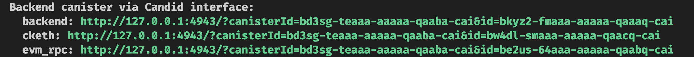

4. Add a new product to the shop using the `addProduct` method.

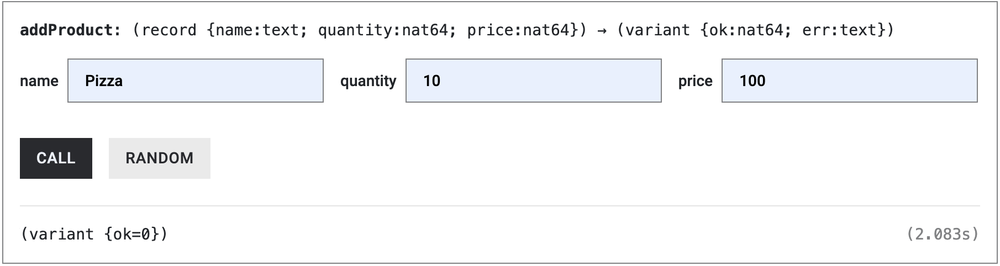

5. Fetch the product details using the `getProducts` method.

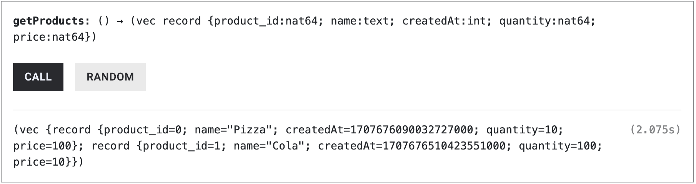

6.  Users can add products to the cart and proceed to checkout.

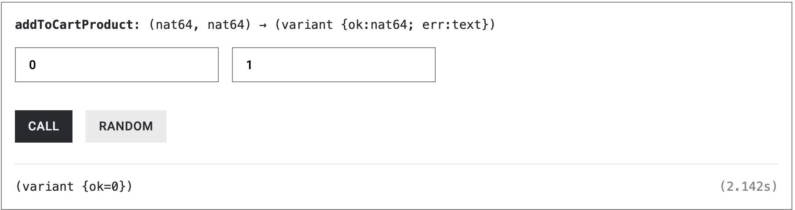
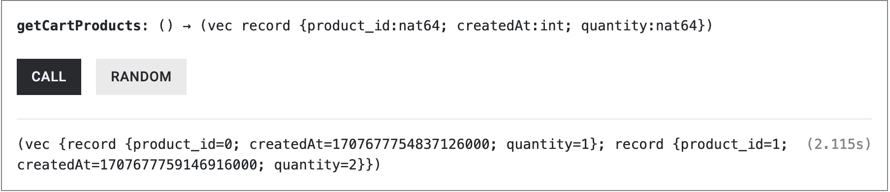
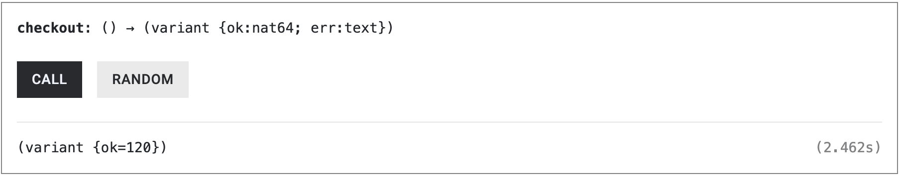

7. Users can intract with minter contract using thier wallet on the Ethereum network to this principal id.

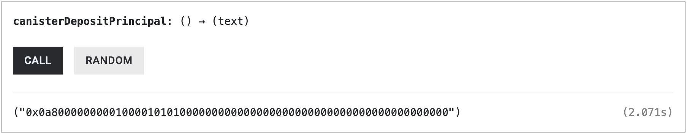
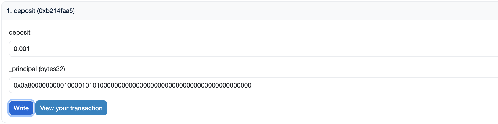
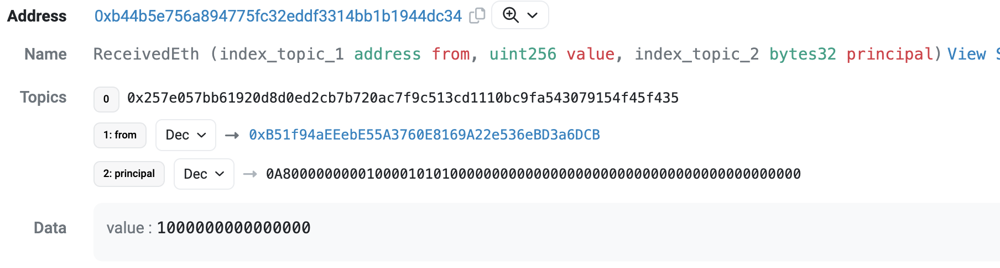
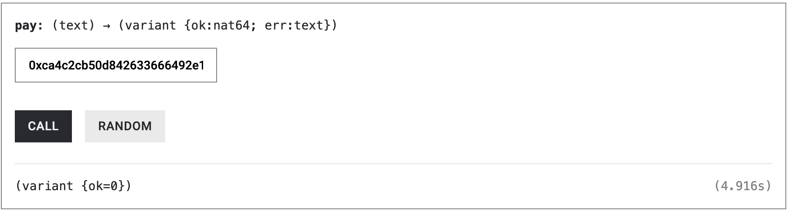

8. The Minter will transfer ckETH tokens into the shop.

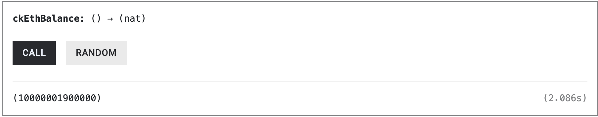

9. Shop owner can transfer ckETH tokens to other users.

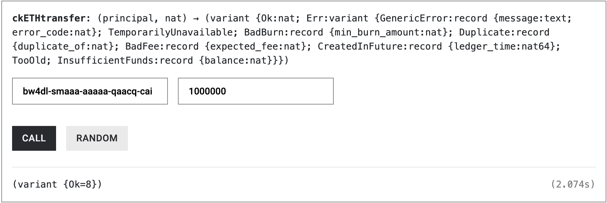

10. Also, Shop owner can withdraw Ether dirctly from the minter contract into his wallet.

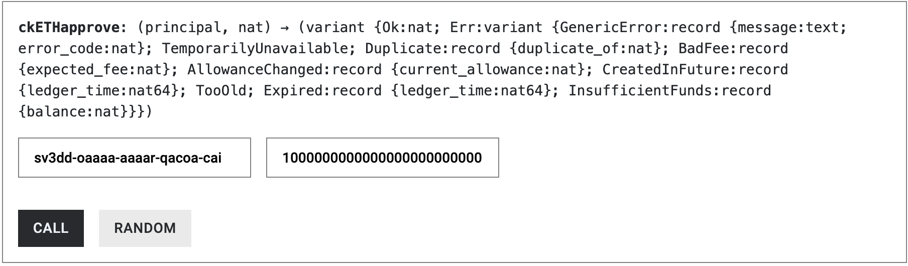

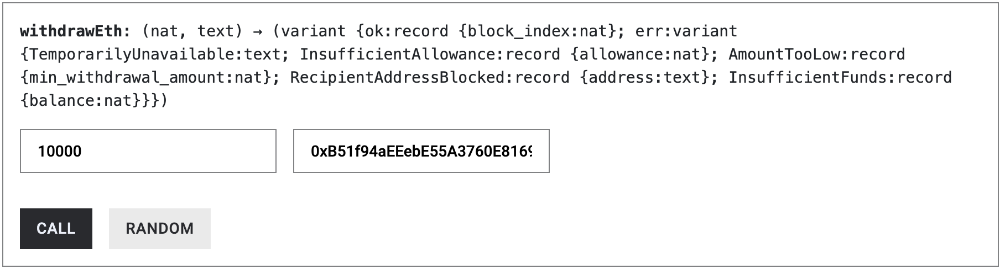
